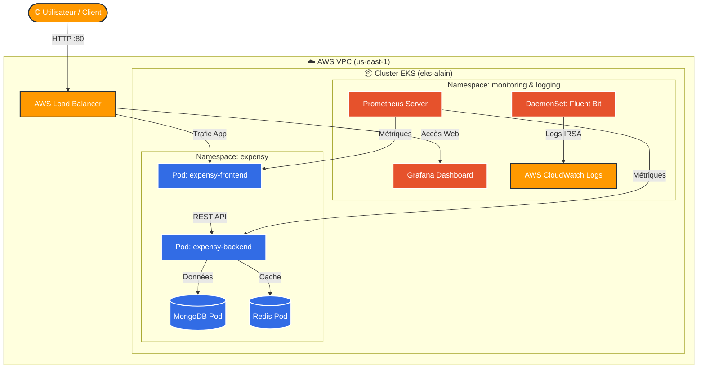

```mermaid

flowchart TD
    classDef aws fill:#FF9900,stroke:#232F3E,stroke-width:2px,color:white;
    classDef k8s fill:#326CE5,stroke:#fff,stroke-width:2px,color:white;
    classDef mon fill:#E6522C,stroke:#fff,stroke-width:2px,color:white;

    User([🌐 Utilisateur / Client]):::aws -->|HTTP :80| ELB[AWS Load Balancer]:::aws

    subgraph AWS_VPC ["☁️ AWS VPC (us-east-1)"]
        ELB -->|Trafic App| Frontend[Pod: expensy-frontend]:::k8s
        ELB -->|Accès Web| Grafana[Grafana Dashboard]:::mon

        subgraph EKS_Cluster ["📦 Cluster EKS (eks-alain)"]
            subgraph App_Namespace ["Namespace: expensy"]
                Frontend -->|REST API| Backend[Pod: expensy-backend]:::k8s
                Backend -->|Données| MongoDB[(MongoDB Pod)]:::k8s
                Backend -->|Cache| Redis[(Redis Pod)]:::k8s
            end

            subgraph Mon_Namespace ["Namespace: monitoring & logging"]
                Grafana
                Prometheus[Prometheus Server]:::mon -->|Métriques| Backend
                Prometheus -->|Métriques| Frontend
                FluentBit[DaemonSet: Fluent Bit]:::mon -->|Logs IRSA| CloudWatch[AWS CloudWatch Logs]:::aws
            end
        end
    end
```    