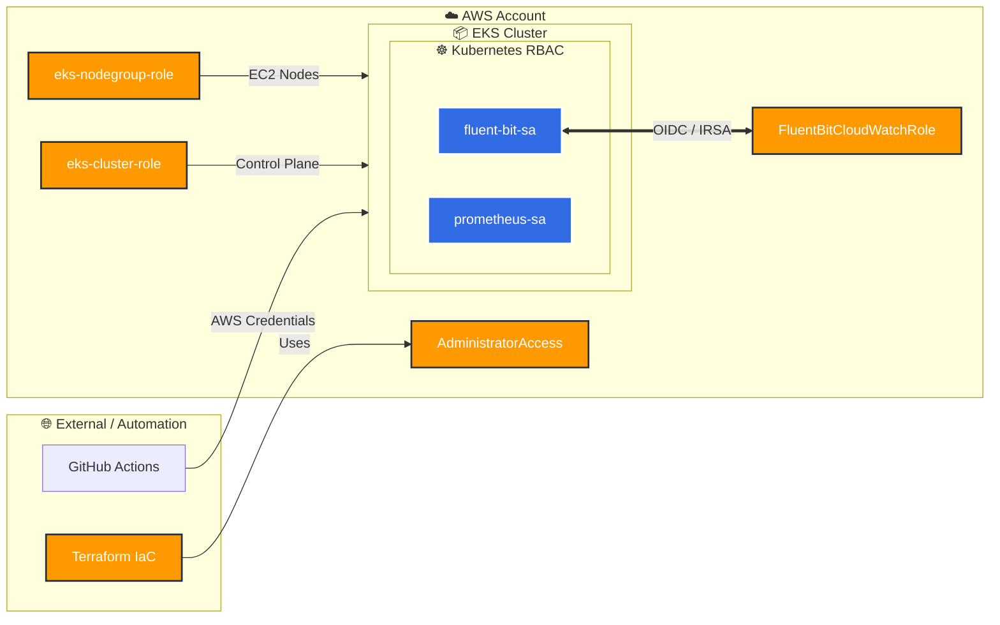

```mermaid
flowchart LR
    classDef aws fill:#FF9900,stroke:#232F3E,stroke-width:2px,color:white;
    classDef k8s fill:#326CE5,stroke:#fff,stroke-width:2px,color:white;

    subgraph External ["🌐 External / Automation"]
        TF[Terraform IaC]:::aws
        GHA[GitHub Actions]
    end

    subgraph AWS_Cloud ["☁️ AWS Account"]
        IAM_TF[AdministratorAccess]:::aws
        IAM_EKS[eks-cluster-role]:::aws
        IAM_Node[eks-nodegroup-role]:::aws
        IAM_CW[FluentBitCloudWatchRole]:::aws

        subgraph EKS ["📦 EKS Cluster"]
            subgraph K8s_RBAC ["☸️ Kubernetes RBAC"]
                SA_FB[fluent-bit-sa]:::k8s
                SA_Prom[prometheus-sa]:::k8s
            end
        end
    end

    TF -->|Uses| IAM_TF
    GHA -->|AWS Credentials| EKS
    
    IAM_EKS -->|Control Plane| EKS
    IAM_Node -->|EC2 Nodes| EKS
    
    SA_FB <==>|OIDC / IRSA| IAM_CW
```